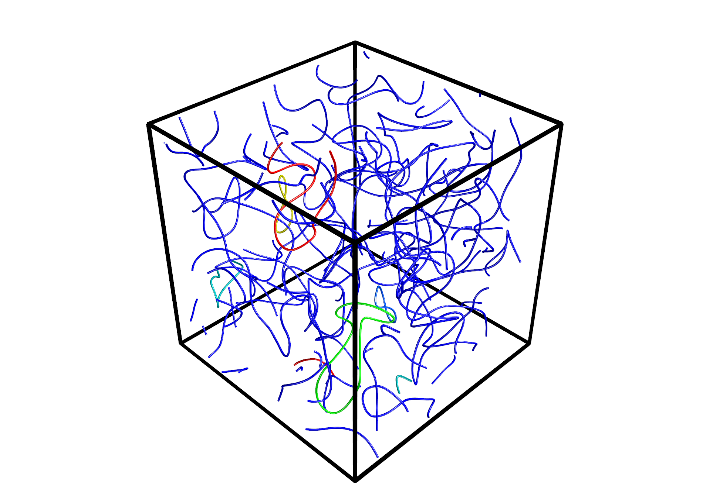

# Nematics3D

## Creator Information
Yingyou Ma, Brandeis, 2025  
https://github.com/YingyouMa
If you have any questions or suggestions, please contact:  yingyouma@outlook.com

## Introduction
The basic analysis of 3D uniaxial nematics.

### field.py
This provides the numerical analysis of the $Q$ field, including diagonalization, interpolation, handling periodic boundary conditions, visualization, and more.

### disclination.py
This provides the disclination analysis, including the detectation, topological analysis, visualization and more.

## Dependencies
This package relies on fundamental scientific computing libraries. I personally use the following versions:
 - **Numpy**:       2.3.2
 - **SciPy**:       1.16.0

For 3D visualization, it uses ```Mayavi```:
 - **mayavi**:      4.8.2

Since I use the unpack operator in subscript notation, ```Python > 3.11``` is required. My personal setup:
 - **Python**:      3.12.9 

## Installation
Currently, I manually place the package in a specific location and import it using a custom path.  
For example, in Windows, I'm applying:
```python
import sys
sys.path.insert(0, "WhereYouPutThePackage")
import Nematics3D
```
To install Mayavi using conda, run the following line on Anaconda Prompt
```
conda install -c conda-forge mayavi=4.8.2
```
A new environment specifically for ```Nematics3D```, or at least ```mayavi```, is highly recommended.

## Getting Started

### Q field
The most basic physical value of nematics system is the **tensor order parameter field** $Q$. In this package, this field is represented by the class ```QFieldObject```, which serves as the core data structure for storing and manipulating $Q$ in 3D space.   

Consider an object ```Q```. Calling ```Q()``` returns the numeric values of all components of $Q$ as a ```np.ndarray``` with shape ```(Nx, Ny, Nz, 5)```. The first three dimensions represent the lattice grid of the 3D field, while the last dimension stores the 5 independent components of $Q$: $Q_{xx}$, $Q_{xy}$, $Q_{xz}$, $Q_{yy}$, $Q_{yz}$, respectively. Similarly, all spatial fields in this package are represented as ```np.ndarray``` with shape ```(Nx, Ny, Nz, ...)```.

There are two ways to initialize an object of ```QFieldObject```.   

1. **Provide the $Q$ field directly**:
```python
Q = Nematics3D.QFieldObject(Q=Q_data, is_diag=True)
```
With the flag ```is_diag=True```, the initialization automatically derive the scalar order parameter field $S$ and director field $n$, represented by ```Q._S``` and ```Q._n```. They could also be calculated later by ```Q.update_diag()```. The input $Q$ data could either in the 5-component form ```(Nx, Ny, Nz, 5)``` or in tensorial structure ```(Nx, Ny, Nz, 9)```.    

2. **Provide $S$ and $n$**, in which case $Q$ is constructed as $Q = S,(nn-\frac{I}{3})$:
```python
Q = Nematics3D.QFieldObject(S=S_data, n=n_data)
```

Another important argument for ```QFieldObject``` is the periodic-boundary-condition flag. For example, ```box_periodic_flag=(True, False, False)``` indicates that only in $x$-direction there is periodic. This setting is crucial for disclination analysis: if PBC is specified incorrectly, a disclination line crossing a periodic boundary would be identified as multiple independent segments.

Finally, you may specify a transformation from lattice coordinates $g$ to real-space coordinates $r$ via $r = k g + b$, where $k$ is a linear transformation matrix (rotation/stretch) and $b$ is a translation vector. These information could be later input by ```Q.update_grid(grid_transform=k, grid_offset=b)```. The grid in the real space is stored in ```Q._grid```.

### Defects detection and basic visualzation
To identify all disclinations in the system, simply use
```python
Q.update_defects()
```
You can then group them into individual smooth disclination lines via:
```python
Q.update_lines_classify()
Q.update_lines_smoothen()
```
All lines are stored in ```Q._lines```, where each entry is a ```DisclinationLine``` object. For the smoothing options and parameters, see the docstrings of ```DisclinationLine.update_smoothen()``` and ```QFieldObject.update_lines_smoothen()```.  Lines are sorted in descending order of length and named sequentially as ```line0```, ```line1```, and so on, according to their index ```i```.     

To visualize these disclination lines in $Q$ field, use ```Q.visualize_disclination_lines()```. One example is
```python
Q.visualize_disclination_lines(min_line_length=20, lines_color_input_all=(1,0,0), radius=1)
```
* ```min_line_length``` ：the minimum length of disclinations to plot. This is set because tiny disclination loops are often below the coarse-grained resolution, making smoothing/visualization less meaningful.
* ```lines_color_input_all``` RGB color(s) in $[0,1]$ for the lines. . If this value is not set, the visualization will use the default colormap which tries to set those longest lines with distinct colors.
* ```radius```: tube radius used for rendering.
* Additional arguments are documented in the function’s docstring.

An example dataset of $S$ and $n$ field is provided under ```example/data```. The simplest code to visualized the smoothened disclination lines is
```python
n = np.load( 'data/n_example_global.npy')
S = np.load( 'data/S_example_global.npy')

Q = Nematics3D.QFieldObject(S=S, n=n, box_periodic_flag=True)

Q.update_defects()
Q.update_lines_classify()
Q.update_lines_smoothen()
Q.visualize_disclination_lines()
```
which produces
<p align="center">
  
</p>


 


