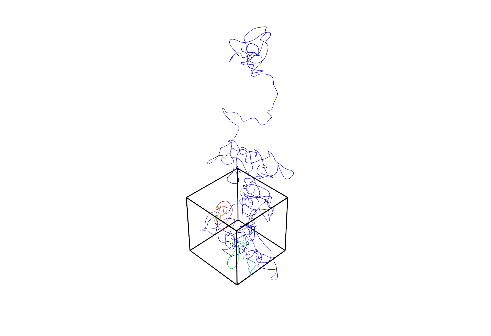
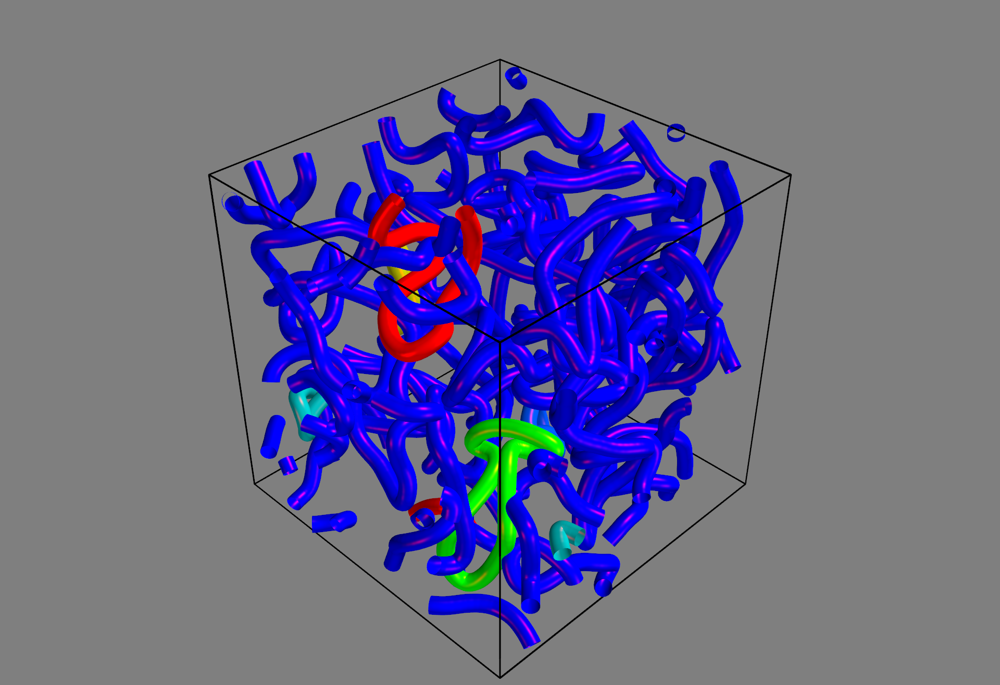

# Nematics3D

## Creator Information
Yingyou Ma, Brandeis, 2025  
https://github.com/YingyouMa
If you have any questions or suggestions, please contact:  yingyouma@outlook.com

## Introduction
The basic analysis of 3D uniaxial nematics.

### field.py
This provides the numerical analysis of the $Q$ field, including diagonalization, interpolation, handling periodic boundary conditions, visualization, and more.

### disclination.py
This provides the disclination analysis, including the detectation, topological analysis, visualization and more.

## Dependencies
This package relies on fundamental scientific computing libraries. I personally use the following versions:
 - **Numpy**:       2.3.2
 - **SciPy**:       1.16.0

For 3D visualization, it uses ```Mayavi```:
 - **mayavi**:      4.8.2

Since I use the unpack operator in subscript notation, ```Python > 3.11``` is required. My personal setup:
 - **Python**:      3.12.9 

## Installation
Currently, I manually place the package in a specific location and import it using a custom path.  
For example, in Windows, I'm applying:
```python
import sys
sys.path.insert(0, "WhereYouPutThePackage")
import Nematics3D
```
To install Mayavi using conda, run the following line on Anaconda Prompt
```
conda install -c conda-forge mayavi=4.8.2
```
A new environment specifically for ```Nematics3D```, or at least ```mayavi```, is highly recommended.

## Getting Started

### Q field
The most basic physical value of nematics system is the **tensor order parameter field** $Q$. In this package, this field is represented by the class ```QFieldObject```, which serves as the core data structure for storing and manipulating $Q$ in 3D space.   

Consider an object ```Q```. Calling ```Q()``` returns the numeric values of all components of $Q$ as a ```np.ndarray``` with shape ```(Nx, Ny, Nz, 5)```. The first three dimensions represent the lattice grid of the 3D field, while the last dimension stores the 5 independent components of $Q$: $Q_{xx}$, $Q_{xy}$, $Q_{xz}$, $Q_{yy}$, $Q_{yz}$, respectively. Similarly, all spatial fields in this package are represented as ```np.ndarray``` with shape ```(Nx, Ny, Nz, ...)```.

There are two ways to initialize an object of ```QFieldObject```.   

1. **Provide the $Q$ field directly**:
```python
Q = Nematics3D.QFieldObject(Q=Q_data, is_diag=True)
```
With the flag ```is_diag=True``` (default is ```True```), the initialization automatically derive the scalar order parameter field $S$ and director field $n$, represented by ```Q._S``` and ```Q._n```. They could also be calculated later by ```Q.update_diag()```. The input $Q$ data could either in the 5-component form ```(Nx, Ny, Nz, 5)``` or in tensorial structure ```(Nx, Ny, Nz, 9)```.    

2. **Provide $S$ and $n$**, in which case $Q$ is constructed as $Q = S,(nn-\frac{I}{3})$:
```python
Q = Nematics3D.QFieldObject(S=S_data, n=n_data)
```

Another important argument for ```QFieldObject``` is the periodic-boundary-condition flag. For example, ```box_periodic_flag=(True, False, False)``` indicates that only in $x$-direction there is periodic. This setting is crucial for disclination analysis: if PBC is specified incorrectly, a disclination line crossing a periodic boundary would be identified as multiple independent segments.

Finally, you may specify a transformation from lattice coordinates $g$ to real-space coordinates $r$ via $r = k g + b$, where $k$ is a linear transformation matrix (rotation/stretch) and $b$ is a translation vector. These information could be later input by ```Q.update_grid(grid_transform=k, grid_offset=b)```. The grid in the real space is stored in ```Q._grid```.

### Defects detection and basic visualzation
To identify all disclinations in the system, simply use
```python
Q.update_defects()
```
You can then group them into individual smooth disclination lines via:
```python
Q.update_lines_classify()
Q.update_lines_smoothen()
```
All lines are stored in ```Q._lines```, where each entry is a ```DisclinationLine``` object. For the smoothing options and parameters, see the docstrings of ```DisclinationLine.update_smoothen()``` and ```QFieldObject.update_lines_smoothen()```.  Lines are sorted in descending order of length and named sequentially as ```line0```, ```line1```, and so on, according to their index.     

To visualize these disclination lines in $Q$ field, use ```Q.visualize_disclination_lines()```. One example is
```python
Q.visualize_disclination_lines(min_line_length=20, lines_color_input_all=(1,0,0), radius=1)
```
* ```min_line_length``` ：the minimum length of disclinations to plot. This is set because tiny disclination loops are often below the coarse-grained resolution, making smoothing/visualization less meaningful.
* ```lines_color_input_all``` RGB color(s) in $[0,1]$ for the lines. . If this value is not set, the visualization will use the default colormap which tries to set those longest lines with distinct colors.
* ```radius```: tube radius used for rendering.
* Additional arguments are documented in the function’s docstring.

An example dataset of $S$ and $n$ field is provided under ```example/data```. The simplest code to visualized the smoothened disclination lines is
```python
n = np.load( 'data/n_example_global.npy')
S = np.load( 'data/S_example_global.npy')

Q = Nematics3D.QFieldObject(S=S, n=n, box_periodic_flag=True)

Q.update_defects()
Q.update_lines_classify()
Q.update_lines_smoothen()
Q.visualize_disclination_lines()
```
which produces
<p align="center">
  
</p>

For the system with periodic boundary conditions, the disclination lines might cross boundaries or even the entire box. To comprehend this phenomena, you can disable line wrapping by setting the flag in ```Q.visualize_disclination_lines(is_wrap=True)```:
<p align="center">
  
</p>

### Structure of figures and post-plot modification
All figures generated by a  ```QFieldObject``` are stored in ```Q.figures``` in chronological order. For example, the figure plotted in the previous section can be addressed as ```Q.figures[0]```.    

Within each figure, the plotted elements are stored in the dictionary ```Q.figures[0].objects['{item name}']```. In the current example, this includes ```Q.figures[0].objects['lines']``` and ```Q.figures[0].objects['extent']```, each of which is a list of the corresponding Mayavi objects. Besides, ```Q.figures[0].fig``` is the underlying ```mayavi``` ```figure``` object itself. You can modify both the figure and its elements even after the plot has been created. For instance, the following code snippet demonstrates how to adjust properties of the current example after plotting
```python
Q.figures[0].fig.scene.background = (0.5, 0.5, 0.5)
extent = Q.figures[0].objects['extent'][0]
extent.opcacity = 0.5
extent.radius = 0.3
for line in Q.figures[0].objects['lines']:
    line.specular_power = 20
    line.specular_color = (1,0,0)
    line.radius = 3
    line.sides = 20
```
the figure correspondingly changes into
<p align="center">
  
</p>

Finally, the figure can be saved by 
```python
Q.figures[0].save('AddressYouLike')
```

### Logging function
Before moving on to additional features, it is helpful to introduce the logging mechanism provided in this package. Logging is enabled through the decorator ```logging_and_warning_decorator``` in ```logging_decorator.py```.    

Several functions in the package are wrapped with this decorator, which controls both the location and the verbosity of logging output. The key parameter is ```log_level```, which specifies the minimum severity of log messages to display. For example, the default setting ```log_level=logging.INFO``` will display only log messages at the ```info```, ```warning``` and ```error``` levels (note: this refers to manually defined ```warning``` calls within this package, not ```warning``` in existing external functions. You will need to ```logging``` before using this argument). Log messages at the ```debug``` level are ignored under this configuration.. 

As an example, the visualization function in Section **Defects detection and basic visualzation** produces the following log output when executed with its default settings
```python
[INFO]
        Start to defect defects
[INFO]
        Finished axis 0-direction in 0.2s
[INFO]
        Finished axis 1-direction in 0.13s
[INFO]
        Finished axis 2-direction in 0.14s
[INFO]
    No data of window_length is input for smoothening lines. 
    Use the default value 61
[INFO]
    No data of minimum line length is input for lines to be smoothened. 
    Use the default value 75
[INFO]
    No data of minimum line length is input for lines to be plotted. Use the default value 75
[INFO]
    No color data is input. Use the default color map, trying to set those longest lines with distinct colors
```
You can also include timestamps by setting ```show_timestamp=True```. This is helpful to further handle the time management. For example:
```python
@Nematics3D.logging_and_warning_decorator
def example_visualize(Q, logger=None):
    Q.update_defects(logger=logger)
    Q.update_lines_classify(logger=logger)
    Q.update_lines_smoothen(logger=logger)
    Q.visualize_disclination_lines(logger=logger)
    
example_visualize(Q, log_level=logging.DEBUG, show_timestamp=True)
```
will generate the logging information
```python
[DEBUG] - 2025-08-12 21:13:46
    Function `example_visualize` STARTED in program `example_q.py`
[DEBUG] - 2025-08-12 21:13:46
        Function `update_defects` STARTED in program `example_q.py`
[DEBUG] - 2025-08-12 21:13:46
            Function `defect_detect` STARTED in program `example_q.py`
[DEBUG] - 2025-08-12 21:13:46
            Threshold of the inner product between the first and last director is 0
[INFO] - 2025-08-12 21:13:46
            Start to defect defects
[DEBUG] - 2025-08-12 21:13:46
            Periodic boundary flags: [ True  True  True]
[INFO] - 2025-08-12 21:13:46
            Finished axis 0-direction in 0.19s
[INFO] - 2025-08-12 21:13:46
            Finished axis 1-direction in 0.13s
[INFO] - 2025-08-12 21:13:47
            Finished axis 2-direction in 0.13s
[DEBUG] - 2025-08-12 21:13:47
            Function `defect_detect` FINISHED in program `example_q.py`. Elapsed time: 0.470 seconds.
[DEBUG] - 2025-08-12 21:13:47
        Function `update_defects` FINISHED in program `example_q.py`. Elapsed time: 0.472 seconds.
[DEBUG] - 2025-08-12 21:13:47
        Function `update_lines_classify` STARTED in program `example_q.py`
[DEBUG] - 2025-08-12 21:13:47
            Function `defect_classify_into_lines` STARTED in program `example_q.py`
[DEBUG] - 2025-08-12 21:13:47
            box_size_periodic: [128. 128. 128.]
[DEBUG] - 2025-08-12 21:13:47
            Start to find neighboring defects
[DEBUG] - 2025-08-12 21:13:47
            Start to perform Hierholzer algorithm
[DEBUG] - 2025-08-12 21:13:47
            Done!
[DEBUG] - 2025-08-12 21:13:47
            Function `defect_classify_into_lines` FINISHED in program `example_q.py`. Elapsed time: 0.400 seconds.
[DEBUG] - 2025-08-12 21:13:47
        Function `update_lines_classify` FINISHED in program `example_q.py`. Elapsed time: 0.400 seconds.
[DEBUG] - 2025-08-12 21:13:47
        Function `update_lines_smoothen` STARTED in program `example_q.py`
[INFO] - 2025-08-12 21:13:47
        No data of window_length is input for smoothening lines. 
        Use the default value 61
[INFO] - 2025-08-12 21:13:47
        No data of minimum line length is input for lines to be smoothened. 
        Use the default value 75
[DEBUG] - 2025-08-12 21:13:47
        Start to smoothen line0
[DEBUG] - 2025-08-12 21:13:47
            Function `apply_smoothen` STARTED in program `example_q.py`
[DEBUG] - 2025-08-12 21:13:47
            Function `apply_smoothen` FINISHED in program `example_q.py`. Elapsed time: 0.005 seconds.
[DEBUG] - 2025-08-12 21:13:47
        Start to smoothen line1
[DEBUG] - 2025-08-12 21:13:47
            Function `apply_smoothen` STARTED in program `example_q.py`
[DEBUG] - 2025-08-12 21:13:47
            Function `apply_smoothen` FINISHED in program `example_q.py`. Elapsed time: 0.000 seconds.
[DEBUG] - 2025-08-12 21:13:47
        Start to smoothen line2
[DEBUG] - 2025-08-12 21:13:47
            Function `apply_smoothen` STARTED in program `example_q.py`
[DEBUG] - 2025-08-12 21:13:47
            Function `apply_smoothen` FINISHED in program `example_q.py`. Elapsed time: 0.000 seconds.
[DEBUG] - 2025-08-12 21:13:47
        Start to smoothen line3
[DEBUG] - 2025-08-12 21:13:47
            Function `apply_smoothen` STARTED in program `example_q.py`
[DEBUG] - 2025-08-12 21:13:47
            Function `apply_smoothen` FINISHED in program `example_q.py`. Elapsed time: 0.001 seconds.
[DEBUG] - 2025-08-12 21:13:47
        Start to smoothen line4
[DEBUG] - 2025-08-12 21:13:47
            Function `apply_smoothen` STARTED in program `example_q.py`
[DEBUG] - 2025-08-12 21:13:47
            Function `apply_smoothen` FINISHED in program `example_q.py`. Elapsed time: 0.000 seconds.
[DEBUG] - 2025-08-12 21:13:47
        Start to smoothen line5
[DEBUG] - 2025-08-12 21:13:47
            Function `apply_smoothen` STARTED in program `example_q.py`
[DEBUG] - 2025-08-12 21:13:47
            Function `apply_smoothen` FINISHED in program `example_q.py`. Elapsed time: 0.000 seconds.
[DEBUG] - 2025-08-12 21:13:47
        Function `update_lines_smoothen` FINISHED in program `example_q.py`. Elapsed time: 0.007 seconds.
[DEBUG] - 2025-08-12 21:13:47
        Function `visualize_disclination_lines` STARTED in program `example_q.py`
[INFO] - 2025-08-12 21:13:47
        No data of minimum line length is input for lines to be plotted. Use the default value 75
[INFO] - 2025-08-12 21:13:47
        No color data is input. Use the default color map, trying to set those longest lines with distinct colors
[DEBUG] - 2025-08-12 21:13:47
        Start to draw disclination lines
[DEBUG] - 2025-08-12 21:13:47
            Function `visualize` STARTED in program `example_q.py`
[DEBUG] - 2025-08-12 21:13:47
            Start to visualize line0
[DEBUG] - 2025-08-12 21:13:47
                Function `PlotTube.__init__` STARTED in program `example_q.py`
[DEBUG] - 2025-08-12 21:13:48
                Function `PlotTube.__init__` FINISHED in program `example_q.py`. Elapsed time: 0.711 seconds.
[DEBUG] - 2025-08-12 21:13:48
            Function `visualize` FINISHED in program `example_q.py`. Elapsed time: 0.714 seconds.
[DEBUG] - 2025-08-12 21:13:48
            Function `add_object` STARTED in program `example_q.py`
[DEBUG] - 2025-08-12 21:13:48
            Function `add_object` FINISHED in program `example_q.py`. Elapsed time: 0.000 seconds.
[DEBUG] - 2025-08-12 21:13:48
            Function `visualize` STARTED in program `example_q.py`
[DEBUG] - 2025-08-12 21:13:48
            Start to visualize line1
[DEBUG] - 2025-08-12 21:13:48
                Function `PlotTube.__init__` STARTED in program `example_q.py`
[DEBUG] - 2025-08-12 21:13:48
                Function `PlotTube.__init__` FINISHED in program `example_q.py`. Elapsed time: 0.034 seconds.
[DEBUG] - 2025-08-12 21:13:48
            Function `visualize` FINISHED in program `example_q.py`. Elapsed time: 0.034 seconds.
[DEBUG] - 2025-08-12 21:13:48
            Function `add_object` STARTED in program `example_q.py`
[DEBUG] - 2025-08-12 21:13:48
            Function `add_object` FINISHED in program `example_q.py`. Elapsed time: 0.000 seconds.
[DEBUG] - 2025-08-12 21:13:48
            Function `visualize` STARTED in program `example_q.py`
[DEBUG] - 2025-08-12 21:13:48
            Start to visualize line2
[DEBUG] - 2025-08-12 21:13:48
                Function `PlotTube.__init__` STARTED in program `example_q.py`
[DEBUG] - 2025-08-12 21:13:48
                Function `PlotTube.__init__` FINISHED in program `example_q.py`. Elapsed time: 0.011 seconds.
[DEBUG] - 2025-08-12 21:13:48
            Function `visualize` FINISHED in program `example_q.py`. Elapsed time: 0.012 seconds.
[DEBUG] - 2025-08-12 21:13:48
            Function `add_object` STARTED in program `example_q.py`
[DEBUG] - 2025-08-12 21:13:48
            Function `add_object` FINISHED in program `example_q.py`. Elapsed time: 0.000 seconds.
[DEBUG] - 2025-08-12 21:13:48
            Function `visualize` STARTED in program `example_q.py`
[DEBUG] - 2025-08-12 21:13:48
            Start to visualize line3
[DEBUG] - 2025-08-12 21:13:48
                Function `PlotTube.__init__` STARTED in program `example_q.py`
[DEBUG] - 2025-08-12 21:13:48
                Function `PlotTube.__init__` FINISHED in program `example_q.py`. Elapsed time: 0.033 seconds.
[DEBUG] - 2025-08-12 21:13:48
            Function `visualize` FINISHED in program `example_q.py`. Elapsed time: 0.033 seconds.
[DEBUG] - 2025-08-12 21:13:48
            Function `add_object` STARTED in program `example_q.py`
[DEBUG] - 2025-08-12 21:13:48
            Function `add_object` FINISHED in program `example_q.py`. Elapsed time: 0.000 seconds.
[DEBUG] - 2025-08-12 21:13:48
            Function `visualize` STARTED in program `example_q.py`
[DEBUG] - 2025-08-12 21:13:48
            Start to visualize line4
[DEBUG] - 2025-08-12 21:13:48
                Function `PlotTube.__init__` STARTED in program `example_q.py`
[DEBUG] - 2025-08-12 21:13:48
                Function `PlotTube.__init__` FINISHED in program `example_q.py`. Elapsed time: 0.011 seconds.
[DEBUG] - 2025-08-12 21:13:48
            Function `visualize` FINISHED in program `example_q.py`. Elapsed time: 0.012 seconds.
[DEBUG] - 2025-08-12 21:13:48
            Function `add_object` STARTED in program `example_q.py`
[DEBUG] - 2025-08-12 21:13:48
            Function `add_object` FINISHED in program `example_q.py`. Elapsed time: 0.000 seconds.
[DEBUG] - 2025-08-12 21:13:48
            Function `visualize` STARTED in program `example_q.py`
[DEBUG] - 2025-08-12 21:13:48
            Start to visualize line5
[DEBUG] - 2025-08-12 21:13:48
                Function `PlotTube.__init__` STARTED in program `example_q.py`
[DEBUG] - 2025-08-12 21:13:48
                Function `PlotTube.__init__` FINISHED in program `example_q.py`. Elapsed time: 0.011 seconds.
[DEBUG] - 2025-08-12 21:13:48
            Function `visualize` FINISHED in program `example_q.py`. Elapsed time: 0.011 seconds.
[DEBUG] - 2025-08-12 21:13:48
            Function `add_object` STARTED in program `example_q.py`
[DEBUG] - 2025-08-12 21:13:48
            Function `add_object` FINISHED in program `example_q.py`. Elapsed time: 0.000 seconds.
[DEBUG] - 2025-08-12 21:13:48
            Function `add_object` STARTED in program `example_q.py`
[DEBUG] - 2025-08-12 21:13:48
            Function `add_object` FINISHED in program `example_q.py`. Elapsed time: 0.000 seconds.
[DEBUG] - 2025-08-12 21:13:48
        Function `visualize_disclination_lines` FINISHED in program `example_q.py`. Elapsed time: 1.375 seconds.
[DEBUG] - 2025-08-12 21:13:48
    Function `example_visualize` FINISHED in program `example_q.py`. Elapsed time: 2.254 seconds.
```
You may have noticed that the indentation of different log messages varies. This indentation is used to reflect the call hierarchy, making it easier to see when one function is invoked within another (its “parent” function).   

If the log output becomes too verbose, you can redirect it to a file by setting ```log_folder={AddressYouLike}, mode='file'```. The example of logging file from the aforementioned code is  ```example/log/example_visualize_20250812_211904_959843```, where the trailing numeric sequence encodes the exact date, time, and microsecond of file creation ```YYYYMMDD_HHMMSS_microseconds```. This ensures uniqueness timestamping. Finally, to disable all logging output entirely, set ```mode='none'```.


 


