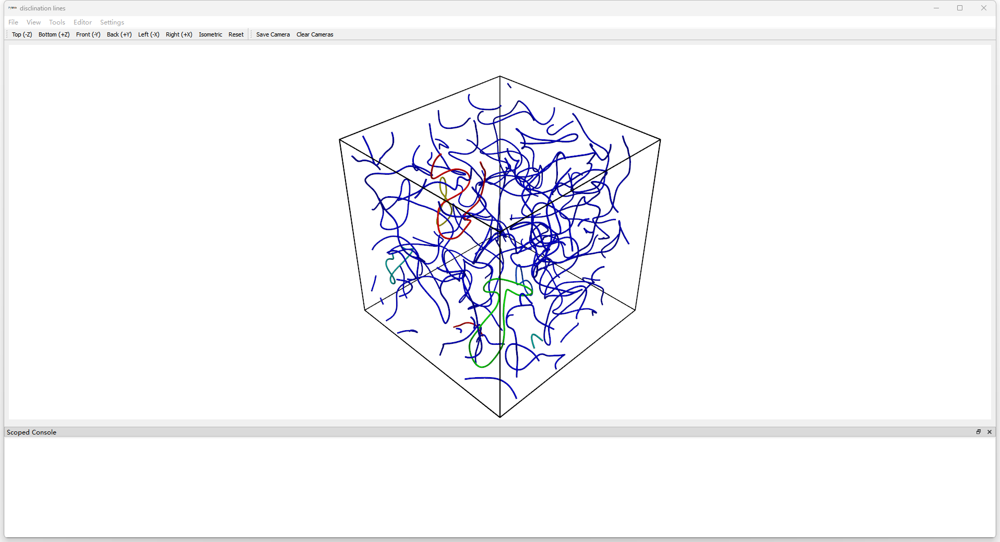
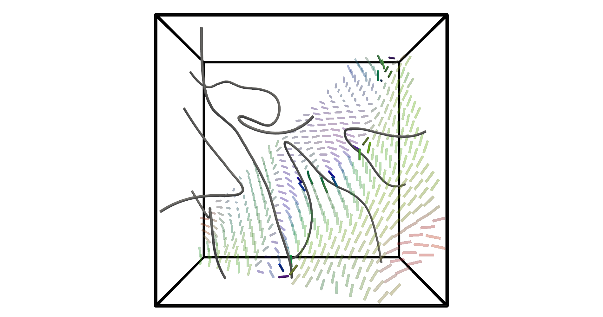
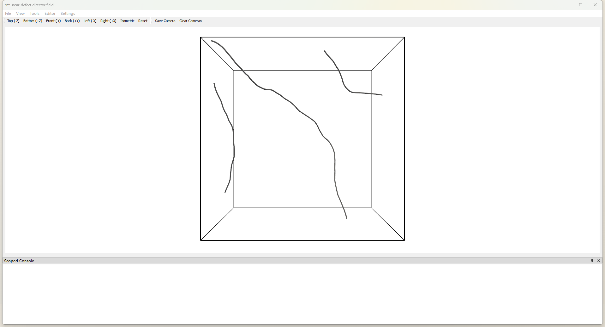

# Nematics3D

Tools for 3D nematic field analysis and visualization.


Nematics3D provides a Python interface for working with 3D nematic fields. It supports building `QFieldObject` instances from tensor or director-based inputs, detecting and classifying disclination defects, smoothing and interpolating line data, and generating 3D visualizations for analysis. The current release is a beta version intended for early use, feedback, and bug discovery.

## Installation

Nematics3D is currently tested with Python 3.12. A dedicated virtual environment is recommended for installation.


```bash
git clone https://github.com/YingyouMa/Nematics3D.git
cd Nematics3D
python -m venv .venv
.venv\Scripts\activate
python -m pip install --upgrade pip
pip install .
```

If you prefer conda, you can create an environment first and then install the package with pip:

```bash
conda create -n Nematics3D python=3.12
conda activate Nematics3D
pip install .
```

You can verify the installation with:

```python
import Nematics3D
```

## Main Features

- Build `QFieldObject` instances from `Q` tensors or from `S` and `n`.
- Detect defects and classify them into disclination lines.
- Smooth and interpolate disclination-line geometry.
- Visualize disclination lines, scalar fields, and director fields in 3D.
- Plot local director or scalar structure on planes and cross-sections.

## Quick Start

The following example loads the sample `S` and `n` fields from `example/data`, builds a `QFieldObject`, smooths the detected disclination lines, and visualizes them. The full script is available as [`example/example_quickstart.py`](/D:/Document/GitHub/Nematics3D/example/example_quickstart.py).

```python
import numpy as np
import Nematics3D

n = np.load("example/data/n_example_global.npy")
S = np.load("example/data/S_example_global.npy")

Q = Nematics3D.QFieldObject(S=S, n=n, name="testQ")
Q.act_lines_smooth()  # smooth the detected disclination lines
Q.act_visualize_disclination_lines()  # visualize the disclination lines in the system
```

Running this script produces a disclination-line visualization like the one below:



During execution, you will see progress and info messages in the terminal. These messages report steps such as Q-field initialization, defect detection, line classification, smoothing, and visualization. They are normal and do not indicate an error.

The visualization opens in an interactive 3D figure window. The example above shows one typical view of that window after the disclination lines have been rendered.

In this quick-start example, the disclination lines use the default coloring. Different lines are assigned different colors, and the palette is chosen to keep the lines visually distinct from one another.

## More Informative Examples

### Example 1: Lines and a Tilted Director Plane

The next example combines disclination lines with a director field on a plane inside a smaller region of the sample. This gives a more informative view of the local structure while still keeping the code compact. The full script is available as [`example/example_informative.py`](/D:/Document/GitHub/Nematics3D/example/example_informative.py).

```python
import numpy as np
import Nematics3D

n = np.load("example/data/n_example_global.npy")
S = np.load("example/data/S_example_global.npy")
n = n[:60, :60, :60]
S = S[:60, :60, :60]

Q = Nematics3D.QFieldObject(S=S, n=n, name="testQ")
Q.act_lines_smooth()  # smooth the detected disclination lines

figure = Nematics3D.PlotFigure(
    name="lines and directors",
    is_off_screen=True,
)  # render off-screen so the example can save the figure directly

Q.act_visualize_disclination_lines(
    figure=figure,
    line_color=(0.5, 0.5, 0.5),
    line_radius=0.3,
)  # draw the disclination lines in the loaded subvolume

# Here the `grid_*` arguments control the geometry of the director plane,
# such as its orientation, position, size, and sampling spacing.
Q.act_visualize_n_plane(
    figure=figure,
    is_extent=False,  # do not draw another bounding box for this layer
    grid_normal=(1, 1, 1),
    grid_origin=(24, 24, 24),
    grid_size=100,
    grid_spacing=3,
    n_length=3,
)  # add the director field on a tilted plane

figure.act_commit(
    elevation=0,
    azimuth=90,
    distance=150,
)  # adjust the camera for a clearer view

figure.act_savefig("docs/example/informative/2.png")  # save the rendered figure
```

This example first crops the example data to the `0` to `60` subvolume in each direction, then creates one shared figure, draws the disclination lines in that cropped system, adds a director field on a tilted plane, and finally rotates the view for a clearer presentation.

With the default settings, directors near defects are highlighted by being fully opaque, while directors farther from defects remain semi-transparent. In this example, you can observe that the opaque directors surround the intersection between the disclination line and the plane.

You may also notice an opaque director near the upper-right part of the image without a visible disclination line. In this example, that happens because the corresponding local defect line segment inside the cropped Q-field is shorter than the minimum line length required for plotting. This threshold can be adjusted in `act_visualize_disclination_lines()`; see that function's docstring for the relevant options.

In this example, the director field also uses its default coloring. The rods are colored according to their orientation, which helps reveal directional variation across the plane.

One example output is shown below:



### Example 2: Local Disclination Lines

The next example crops the sample further to a `0` to `30` subvolume, smooths the detected disclination lines with shorter thresholds, and then renders the local lines only. The full script is available as [`example/example_informative_near_defect.py`](/D:/Document/GitHub/Nematics3D/example/example_informative_near_defect.py).

```python
import numpy as np
import Nematics3D

n = np.load("example/data/n_example_global.npy")
S = np.load("example/data/S_example_global.npy")
n = n[:30, :30, :30]
S = S[:30, :30, :30]

Q = Nematics3D.QFieldObject(S=S, n=n, name="testQ")
Q.act_lines_smooth(min_line_length=20, window_length=10)  # smooth shorter local lines

figure = Nematics3D.PlotFigure(
    name="near-defect director field",
    is_off_screen=True,
)  # render off-screen so the example can save the figure directly

Q.act_visualize_disclination_lines(
    figure=figure,
    line_color=(0.5, 0.5, 0.5),
    line_radius=0.1,
    extent_radius=0.05,
    min_line_length=20,
)  # draw only the local disclination lines in the cropped subvolume

figure.act_commit(
    elevation=0,
    azimuth=90,
    distance=70,
)  # adjust the camera for a clearer view

figure.act_savefig("docs/example/informative/3.png")  # save the rendered figure
```

This example focuses on a smaller local subvolume and uses a shorter smoothing window together with a shorter minimum line length so that local defect structure can be shown more clearly. It is useful when you want to inspect local disclination geometry without introducing additional plane or near-defect visualization layers.

One example output is shown below:


