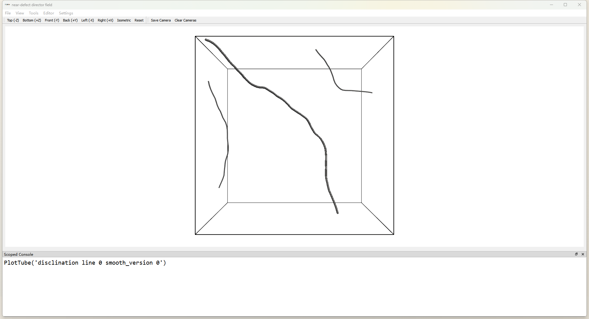
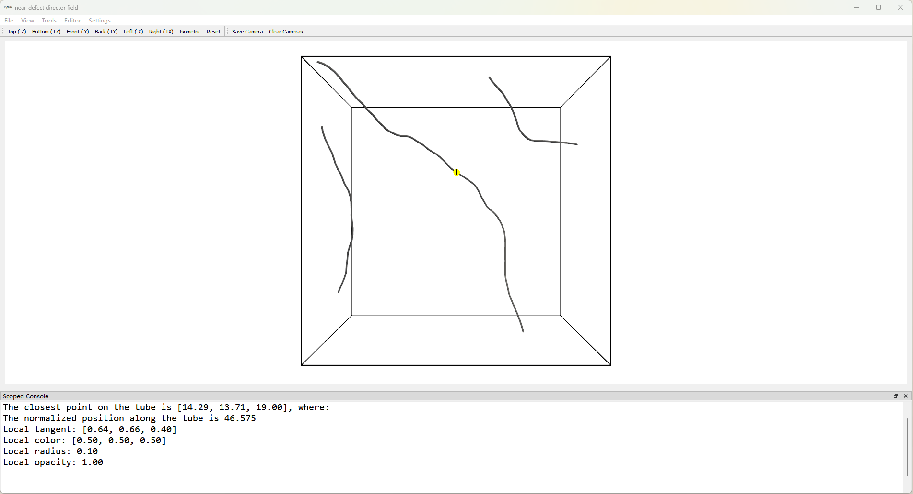
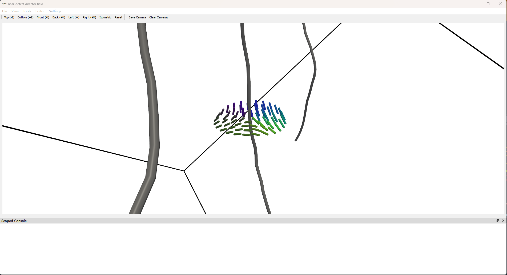
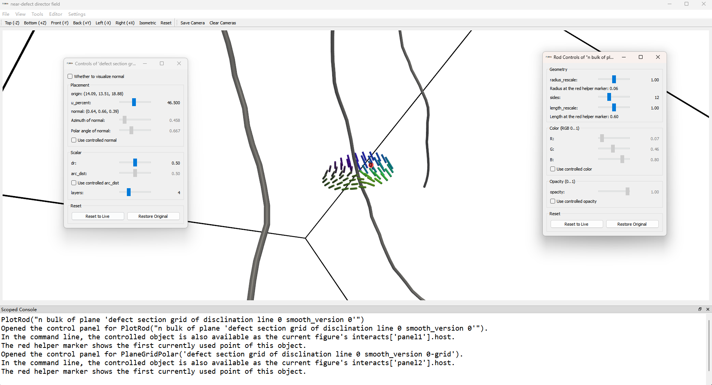
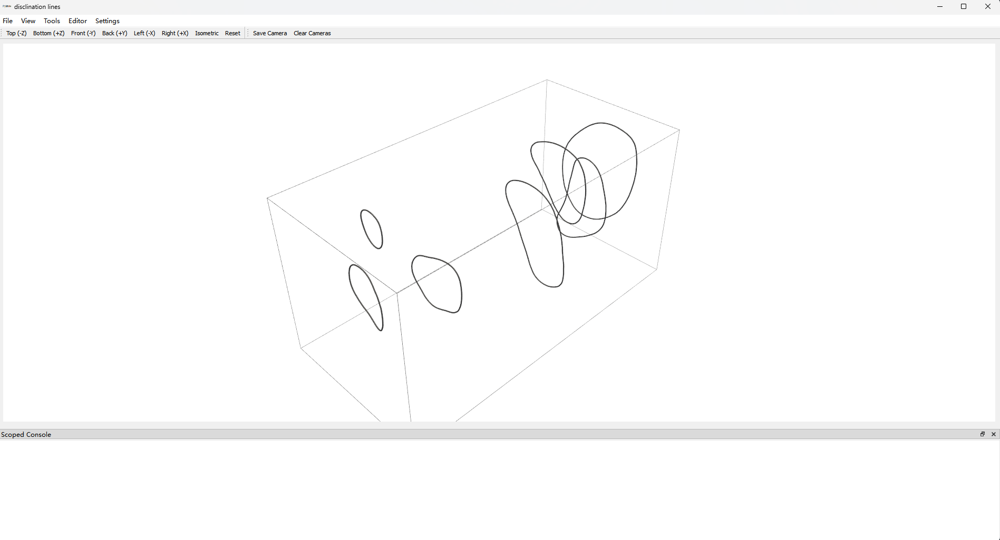
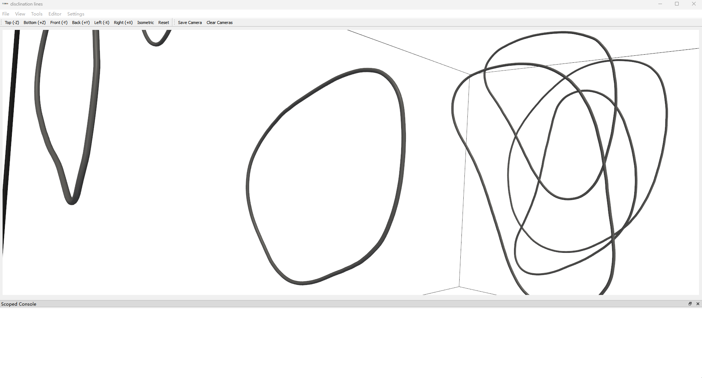
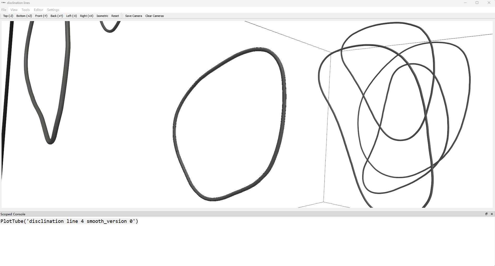
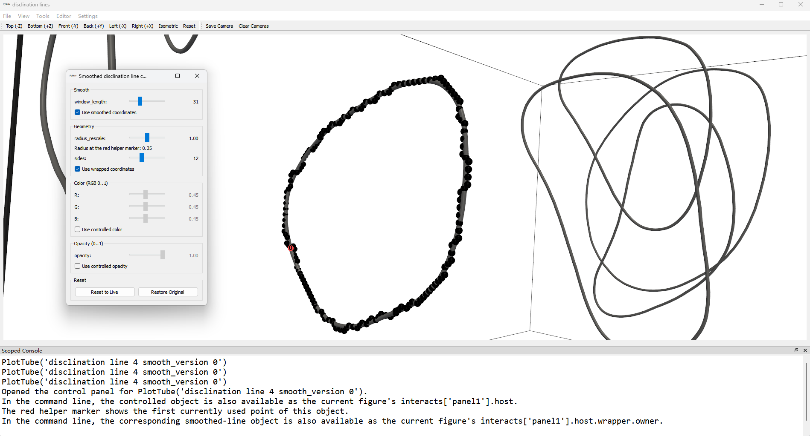
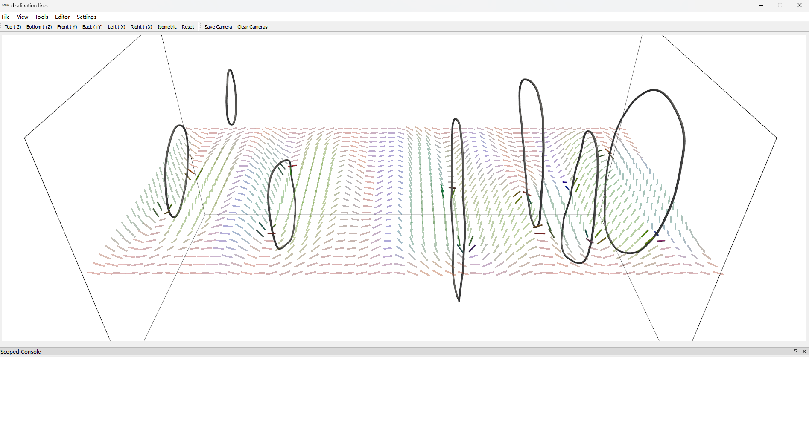
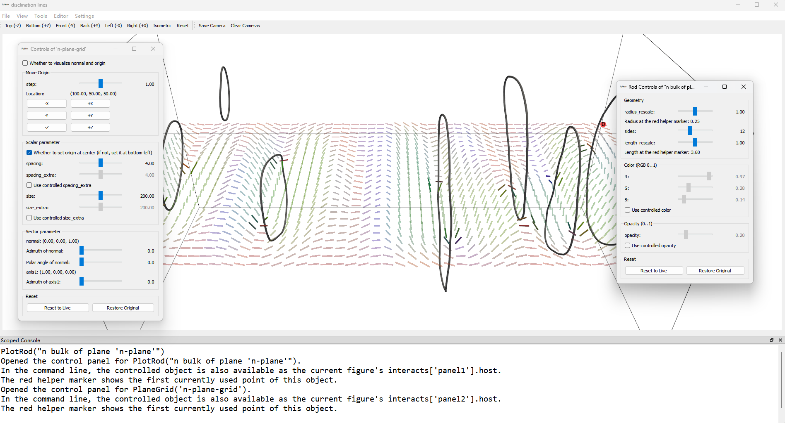

# Nematics3D

Tools for 3D nematic field analysis and visualization.


Nematics3D provides a Python interface for working with 3D nematic fields. It supports building `QFieldObject` instances from tensor or director-based inputs, detecting and classifying disclination defects, smoothing and interpolating line data, and generating 3D visualizations for analysis. The current release is a beta version intended for early use, feedback, and bug discovery.

## Installation

Nematics3D is currently tested with Python 3.12. Compatibility with other Python versions has not yet been confirmed. A dedicated virtual environment is recommended for installation.


```bash
git clone https://github.com/YingyouMa/nematics3d.git
cd Nematics3D
python -m venv .venv
.venv\Scripts\activate
python -m pip install --upgrade pip
pip install .
```

Here `.venv` is only an example environment-folder name. You can replace it with any folder name you prefer, as long as the activation command is updated consistently.

If you prefer conda, you can create an environment first and then install the package with pip:

```bash
conda create -n Nematics3D python=3.12
conda activate Nematics3D
pip install .
```

Here `Nematics3D` is only an example conda environment name. You can replace it with any name you prefer.

You can verify the installation with:

```python
import nematics3d
```

## Main Features

- Build `QFieldObject` instances from `Q` tensors or from `S` and `n`.
- Detect defects and classify them into disclination lines.
- Smooth and interpolate disclination-line geometry.
- Visualize disclination lines, scalar fields, and director fields in 3D.
- Plot local director or scalar structure on planes and cross-sections.

## Quick Start

The following example loads the sample `S` and `n` fields from `example/data`, builds a `QFieldObject`, smooths the detected disclination lines, and visualizes them. The full script is available as [`example/example_quickstart.py`](/D:/Document/GitHub/Nematics3D/example/example_quickstart.py).

```python
import numpy as np
import nematics3d

n = np.load("example/data/n_example_global.npy")
S = np.load("example/data/S_example_global.npy")

Q = nematics3d.QFieldObject(S=S, n=n, box_periodic_flag=True, name="testQ")
Q.act_lines_smooth()  # smooth the detected disclination lines
Q.act_visualize_disclination_lines()  # visualize the disclination lines in the system
```

Running this script produces a disclination-line visualization like the one below:


During execution, you will see progress and info messages in the terminal. These messages report steps such as Q-field initialization, defect detection, line classification, smoothing, and visualization. They are normal and do not indicate an error.

The visualization opens in an interactive 3D figure window. The example above shows one typical view of that window after the disclination lines have been rendered. PyVista's built-in camera interactions include rotating the camera by holding the left mouse button and dragging, zooming by rolling the mouse wheel or by holding the right mouse button and dragging, and translating the camera by holding the middle mouse button and dragging.

In this quick-start example, the disclination lines use the default coloring. Different lines are assigned different colors, and the palette is chosen to keep the lines visually distinct from one another.

## More Informative Examples

### Example 1: Lines and a Tilted Director Plane

The next example combines disclination lines with a director field on a plane inside a smaller region of the sample. This gives a more informative view of the local structure while still keeping the code compact. The full script is available as [`example/example_informative.py`](/D:/Document/GitHub/Nematics3D/example/example_informative.py).

```python
import numpy as np
import nematics3d

n = np.load("example/data/n_example_global.npy")
S = np.load("example/data/S_example_global.npy")
n = n[:60, :60, :60]
S = S[:60, :60, :60]

Q = nematics3d.QFieldObject(S=S, n=n, name="testQ")
Q.act_lines_smooth()  # smooth the detected disclination lines

figure = nematics3d.PlotFigure(
    name="lines and directors",
    is_off_screen=True,
)  # render off-screen so the example can save the figure directly

Q.act_visualize_disclination_lines(
    figure=figure,
    line_color=(0.5, 0.5, 0.5),
    line_radius=0.3,
)  # draw the disclination lines in the loaded subvolume

# Here the `grid_*` arguments control the geometry of the director plane,
# such as its orientation, position, size, and sampling spacing.
Q.act_visualize_n_plane(
    figure=figure,
    is_extent=False,  # do not draw another bounding box for this layer
    grid_normal=(1, 1, 1),
    grid_origin=(24, 24, 24),
    grid_size=100,
    grid_spacing=3,
    n_length=3,
)  # add the director field on a tilted plane

figure.act_commit(
    elevation=0,
    azimuth=90,
    distance=150,
)  # adjust the camera for a clearer view

figure.act_savefig("docs/example/informative/2.png")  # save the rendered figure
```

This example first crops the example data to the `0` to `60` subvolume in each direction, then creates one shared figure, draws the disclination lines in that cropped system, adds a director field on a tilted plane, and finally rotates the view for a clearer presentation.

With the default settings, directors near defects are highlighted by being fully opaque, while directors farther from defects remain semi-transparent. In this example, you can observe that the opaque directors surround the intersection between the disclination line and the plane.

You may also notice an opaque director near the upper-right part of the image without a visible disclination line. In this example, that happens because the corresponding local defect line segment inside the cropped Q-field is shorter than the minimum line length required for plotting. This threshold can be adjusted in `act_visualize_disclination_lines()`; see that function's docstring for the relevant options.

In this example, the director field also uses its default coloring. The rods are colored according to their orientation, which helps reveal directional variation across the plane.

One example output is shown below:


### Example 2: Local Disclination Lines

The next example crops the sample further to a `0` to `30` subvolume, smooths the detected disclination lines with shorter thresholds, and then renders the local lines only. This example also introduces the extra interactive features implemented in this library. The full script is available as [`example/example_informative_near_defect.py`](/D:/Document/GitHub/Nematics3D/example/example_informative_near_defect.py).

```python
import numpy as np
import nematics3d

n = np.load("example/data/n_example_global.npy")
S = np.load("example/data/S_example_global.npy")
n = n[:30, :30, :30]
S = S[:30, :30, :30]

Q = nematics3d.QFieldObject(S=S, n=n, name="testQ")
Q.act_lines_smooth(min_line_length=20, window_length=10)  # smooth shorter local lines

figure = nematics3d.PlotFigure(
    name="near-defect director field",
)  # create one shared figure

Q.act_visualize_disclination_lines(
    figure=figure,
    line_color=(0.5, 0.5, 0.5),
    line_radius=0.1,
    extent_radius=0.05,
    min_line_length=20,
)  # draw only the local disclination lines in the cropped subvolume

figure.act_commit(
    elevation=0,
    azimuth=90,
    distance=70,
)  # adjust the camera for a clearer view
```

This example focuses on local detail. The smoothing `window_length` is reduced, and the `min_line_length` thresholds in both `act_lines_smooth()` and `act_visualize_disclination_lines()` are also reduced; otherwise there would be no disclination lines left to plot in this smaller subvolume.

One example output is shown below:


Besides the built-in PyVista camera controls, this figure also supports object-level interactions. A right click highlights the picked object with a silhouette and reports its name in the scoped console. In the example shown above, the selected object is `PlotTube('disclination line 0 smooth_version 0')`.



To inspect local physical information quickly and directly from the rendered image, you can left double-click to pick one point on a plotted object and display related information in the console. Different plotted objects report different contents. In this example, for a `PlotTube` object, one useful quantity is the normalized position along the tube, which is defined from `0` to `100` by the ordering of the tube centerline points.



This normalized position parameter is convenient because it gives a one-dimensional position label along the disclination line. For a curved 3D disclination line, this is often more intuitive and easier to reproduce than recording a spatial coordinate directly. After selecting one interesting point in the figure, we can then use this position parameter to specify later calculations, for example by plotting the local director field near that point.

For example, we can continue with the following code:

```python
smooth0 = Q.lines[0].smooths[0]  # select the smoothed version 0 of disclination line 0, as stated in the console
Q.act_visualize_n_near_defect(
    u_percent=46.5,  # the normalized position selected in the last figure
    smooth=smooth0,
    figure=figure,
    is_extent=False,
)  # visualize the local director field near that position on the selected line
```

The following image shows the local director field rendered around that selected position. The camera was then adjusted using the built-in PyVista interaction tools.



The last interaction mode is right double-click, which opens a live control panel. For example, if you right double-click the plotted directors there, two panels appear: one controls the polar grid on which these directors are sampled, and the other controls the visual parameters of the director rods themselves.



Up to this point, we have shown the minimum implementation needed to build a `QFieldObject` from field data, detect and smooth disclination lines, visualize global and local director structures, inspect local line information interactively, and open live control panels for further adjustment. This is already enough for the most basic analysis of a 3D nematic field.

For a more complete analysis, we recommend the following workflow:

1. Generate a `QFieldObject` from your `Q` tensor field or from `S` and `n`. During this initialization step, the object automatically finds defect points and classifies them into disclination lines by default.
2. If disclination lines are one of your main interests, smooth and visualize them first. This usually gives the fastest overview of the global defect structure before moving on to more detailed inspection.
3. Use the built-in `Q.act_visualize_*()` functions for an initial survey of the system. Typical first views include disclination lines, `S`-field sections, and `n`-field sections.
4. Use the interactive visualization tools to inspect the plotted objects, rotate the view, and identify regions or line positions that look physically interesting.
5. Once you have located an interesting region, continue with a more local analysis, for example by plotting a local plane or a near-defect director structure around a selected part of a disclination line.

## A Workflow Example: Inspecting a Defect Loop

In this section, we use the bundled example data to work through one concrete task: visualize defect loops in a three-dimensional nematic field, then choose one loop for a simple topological and geometric inspection. The data used here is the precomputed Q-tensor field [`example/data/Q_example_workflow.npy`](/D:/Document/GitHub/Nematics3D/example/data/Q_example_workflow.npy), and the full local script for this workflow starts from [`example/example_workflow_defect_loop.py`](/D:/Document/GitHub/Nematics3D/example/example_workflow_defect_loop.py).

The first step is simply to build the `QFieldObject`. This object will serve as the central container for the field itself, the detected defect points, the classified disclination lines, and the figures or derived objects that we create later.

```python
import numpy as np
import nematics3d

Q_data = np.load("example/data/Q_example_workflow.npy")
Q = nematics3d.QFieldObject(Q=Q_data, name="workflow_Q")
```

At this point, you should already see some initialization logs in the terminal. For the bundled example data, the output should look similar to the following:

```text
[PROGRESS]
    <QFieldObject.__init__>
    Start to initialize Q tensor `workflow_Q`.
[PROGRESS]
    <QFieldObject.__init__>
    Start defect analysis as detecting defects and classifying them into distinct lines for Q tensor `workflow_Q`
    This operation might take a while.
    You can disable this automatic operation by setting is_detect_defects=False and is_classify_lines=False when initializing the Q tensor.
[INFO]
        <QFieldObject[name='workflow_Q'].act_defect_detect>
        1270 defects are found.
[INFO]
        <QFieldObject[name='workflow_Q'].act_lines_classify>
        8 lines are found.
[PROGRESS]
    <QFieldObject.__init__>
    Defect analysis is finished, with 0.94 s
```

Only the final elapsed time is expected to vary noticeably across runs and machines.

These logs are also a useful first sanity check. Before making any plots, the reported defect and line counts can already help you notice obvious problems, such as loading the wrong field data or constructing the `QFieldObject` incorrectly.

Next, we want to plot these defect lines. However, there is one practical issue: the detected lines are still represented by discrete defect points, so plotting them directly usually gives visibly jagged curves. For visualization, it is therefore better to smooth the lines first.

The main helper for smoothing disclination lines is `Q.act_lines_smooth(...)`. Two of its most important parameters are `window_length` and `min_line_length`.

- `window_length` controls the smoothing window. Larger values usually produce smoother curves, but can also wash out finer local structure.
- `min_line_length` sets the minimum raw line length required before smoothing is applied. This is useful because very short lines are often not good candidates for this kind of smoothing.

For example:

```python
Q.act_lines_smooth(
    window_length=31,
    min_line_length=61,
)
```

With the smoothed line geometry prepared, we can now draw the defect lines. To make the 3D geometry easier to read, it is usually helpful to draw both the disclination lines and the outer box extent. This means we now want to control two related but different groups of visual parameters.

In this library, a common way to handle that is to separate option groups by prefixes. In `Q.act_visualize_disclination_lines(...)`, keyword arguments starting with `line_` control the rendered defect lines, while keyword arguments starting with `extent_` control the rendered outer box.

For example:

```python
Q.act_visualize_disclination_lines(
    min_line_length=61,
    line_color=(0.45, 0.45, 0.45),
    line_radius=0.35,
    extent_color=(0.15, 0.15, 0.15),
    extent_radius=0.08,
)
```

This call therefore draws the smoothed disclination lines together with the outer frame, while keeping the line and extent parameters separate and readable. Here `min_line_length=61` uses the same threshold as the smoothing step above, so we only draw lines that were also long enough to be smoothed.

The result should look like this:



At this point, we can use the built-in PyVista interactions mentioned earlier to rotate and translate the camera for a better view of the loops. In particular, you can rotate the camera by holding the left mouse button and dragging, zoom by rolling the mouse wheel or by holding the right mouse button and dragging, and translate the camera by holding the middle mouse button and dragging.

For example, suppose we are interested in the third loop from the left. After adjusting the camera interactively, we may choose a view like the following:



As mentioned earlier, right-clicking a plotted object will highlight it through a silhouette and show related information in the console below. For example:



Here the console shows `PlotTube('disclination line 4 smooth_version 0')`. `PlotTube` means that this plotted object is a `PlotTube`, which is our wrapped object for tube rendering. The name inside the parentheses is the name of this tube. In this case, it means the first smoothed version of the fifth-longest disclination line in the system.

One natural concern at this point is whether the smoothing parameters chosen earlier are actually appropriate. The most direct check is to try different smoothing parameters and compare the resulting line visually against the original unsmoothed version. This can be done directly through our control panel.

As mentioned earlier, double-clicking a plotted object opens its control panel, as shown below:



When opening this panel, you will see a warning. You can safely ignore it in this workflow. For interested users, the warning simply means that the smoothing option `min_line_length` has been automatically lowered to its minimum value `2`, so that this line can be adjusted more conveniently from the control panel.

At this point, the black points are the original unsmoothed defect points. Comparing them with the current smooth tube, we can see that the present smoothing result does not show any obvious problem.

You can drag the `window_length` slider to modify the smoothing in real time. Of course, you are also welcome to try the other sliders and checkboxes to get a feel for what they do. The `Restore Original` button at the bottom restores the backed-up state from the moment when this control panel was opened. After closing the control panel, those original defect points will disappear again, while the changes you made are kept automatically.

Next, let us draw a director-field section. In other words, we create a plane grid and then visualize the director on the sampled grid points.

The main helper for this is `Q.act_visualize_n_plane(...)`. Here we again face the situation that we need to provide at least two groups of parameters: the grid parameters and the director-visualization parameters. As before, this library handles them by separating the keyword arguments with prefixes.

In this function, arguments starting with `grid_` control the plane grid, while arguments starting with `n_` control the rendered directors.

For example:

```python
Q.act_visualize_n_plane(
    is_extent=False,  # the extent is already drawn in the current figure
    grid_normal=(0, 0, 1),
    grid_origin=(100, 50, 50),
    grid_size=200,
    grid_spacing=4,
    n_length=3.6,
    n_radius=0.25,
)
```

Here `is_extent=False` means that we do not draw the outer box again, because it has already been added to the current figure in the previous step. The `grid_origin` here is chosen as the center of the lattice.

After plotting the directors, the result looks like this:



Here we have again adjusted the camera to a view that is more convenient for inspecting the overall director field.

As mentioned earlier, the default coloring of the directors is based on their orientation through a built-in colormap. In addition, directors near defects are rendered opaque, while directors farther away are rendered semi-transparent. This helps highlight the directors around the defect and makes the local geometry near the defect easier to inspect.

Right double-clicking these directors also opens a control panel. For example, right double-clicking one of the semi-transparent directors produces the following panel:



From this control panel, we can see that one part controls the grid and the other part controls the rendered directors.

You may also notice that this panel allows parameter adjustment directly from the command-line backend. In the figure above, it says: `In the command line, the controlled object is also available as the current figure's interacts['panel2'].host`.

So how do we find the current figure? For a `QFieldObject`, the canvases created by its `act_visualize_*()` methods are stored in `.figs`. If you type `Q.figs` in the command line, you will get something like:

```python
FigureManager('figures')
0:       disclination lines
```

Here `0` is the figure index, ordered by creation time, and `disclination lines` is the name of that figure. You can access the figure either by index or by name. In other words, both `Q.figs[0]` and `Q.figs["disclination lines"]` work.

So, going back to the control panel, the note `In the command line, the controlled object is also available as the current figure's interacts['panel2'].host` means that, while this panel is open, the corresponding object can also be modified directly through `Q.figs[0].interacts['panel2'].host`.

In this case, from the console information shown above, we know that the controlled object is `PlaneGrid('n-plane-grid')`, namely the grid object of the director plane.

This is convenient for two reasons. First, some parameters are not easy to adjust from the panel itself, or may not be exposed there at all, so it is often more convenient to modify them directly from the command line. Second, even when you already know that you want to work from the command line, it is often not easy to find the variable name that refers to the relevant object.

This grid object is a typical example of that second difficulty: `PlaneGrid('n-plane-grid')` is certainly relevant to the current figure, but without this hint it is not obvious how to access it directly from the command line. Here the control panel gives that reference path explicitly, so you can immediately access and modify the object without having to search for it yourself.

Now that we can directly access the object from the command line, we should first explain one important concept in this library: `opts`.

Roughly speaking, `opts` stores the option-like parameters of a host object, especially the non-core input data that is still frequently modified after initialization.

`opts` can be accessed directly. For example, if you type `Q.figs[0].interacts['panel2'].host.opts` in the command line and press Enter, you will get the opts of this grid object:

```python
OptsPlaneGrid: the options of PlaneGrid('n-plane-grid')
  tag            = 'plane grid options'
  normal         = array([0., 0., 1.])
  spacing        = 4
  spacing_extra  = None
  size           = 200
  size_extra     = None
  origin         = array([100.,  50.,  50.])
  alignment      = 'center'
  axis1          = array([1., 0., 0.])
  is_clip_inside = True
  grid_offset    = array([0., 0., 0.])
  grid_transform = <ndarray shape=(3, 3), too many elements to display>
```

We do not explain the detailed meaning of each field here. Please see the docstring for that.

Here we modify two fields as simple examples: `spacing` and `origin`, which represent the distance between neighboring grid points and the grid origin position, respectively.

From the command line, there are two common ways to modify them. One is direct assignment:

```python
Q.figs[0].interacts['panel2'].host.opts.origin = (100, 50, 75)  # move the plane upward
Q.figs[0].interacts['panel2'].host.opts.spacing = 4.5
```

The other is to call `act_commit()` directly:

```python
Q.figs[0].interacts['panel2'].host.act_commit(
    origin=(100, 50, 75),
    spacing=4.5,
)
```
